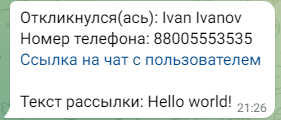

# LeadMessengerBot 

LeadMessengerBot - это бот, который делает рассылку подписавшимся пользователям и создает лид в AmoCRM при отклике.

## Описание

Этот бот предназначен для удобной рассылки сообщений подписчикам и создания лидов в AmoCRM при отклике от пользователей. Он разработан на основе aiogram, используя язык программирования python.

## Конфигурация

Прежде чем запускать бота, убедитесь, что вы настроили следующие параметры:

1. Получили токен у @BotFather и подключили его к чат-боту в config файле.
2. Установили postgres базу данных и создали подключение в config файле.
3. Настроили интеграцию в AmoCRM с python-приложением.

## Основные функции

- Рассылка сообщений подписчикам.
- Обработка откликов от пользователей.
- Создание новых лидов в AmoCRM на основе откликов.
- Сохранение информации подписавшихся пользователей в базу данных.


## Пример работы для администратора

Со списком всех возможных команд, доступных администратору, можно ознакомиться введя /commands.


Для рассылки сообщений введите /send, напишите текст для рассылки и выберите необходимую категорию.


По окончанию рассылки администратору(ам) приходит уведомление.


Так же при отклике уведомление поступает администратору(ам) с информацией о пользователе и ссылкой на чат.



## Пример работы для пользователя

Пройдя авторизацию, пользователь может изменить информацию о себе или категорию для рассылки, введя /settings.


## Используемые библиотеки

``` python
aiogram==2.25.1
amocrm-api==2.5.0
async-timeout==4.0.2
asyncio==3.4.3
asyncpg==0.27.0
```

## Вклад и сообщения об ошибках
Вы можете внести свой вклад в развитие проекта, создавая новые функции или исправляя ошибки. Если у вас есть вопросы, проблемы или предложения, пожалуйста, создайте новый issue в разделе Issues или свяжитесь со мной по электронной почте [kamylov@bk.ru].
